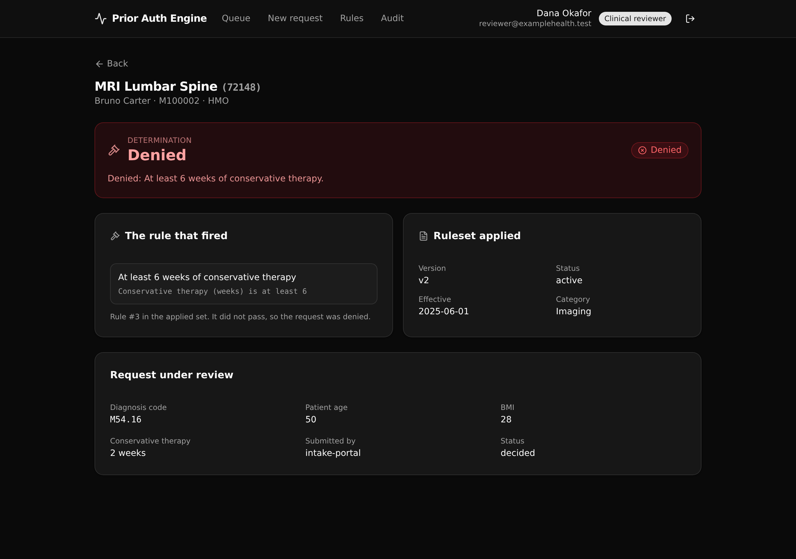

# Prior Authorization Decision Engine

One governed decision service a health plan's intake portal and provider tools all call, instead of each
re-encoding their own medical-necessity rules.

A procedure request comes in, the engine runs the versioned criteria for that procedure, and returns
**approve**, **deny**, or **refer to review** together with the exact rule that fired. Every run is written
to an append-only audit trail. The one governed job: apply medical-necessity rules the same way every time,
and log why each decision was made.

**8 tables · 10 APIs · 1 shared function**



## What it demonstrates

This is a **Business Logic Centralization** proof (Xano's Play 1) for a **healthcare payer**. The
medical-necessity rules live as versioned data in one API layer. A single `decide_request` function is the
only path that produces a decision, so an intake portal and a provider tool cannot drift into their own
copies of the logic. An evaluator cares because this is the control story, not the speed story: the rules
are in one place a person can read, version, and audit.

- **Versioned rulesets.** Each procedure has one active criteria set and keeps its retired ones, so a
  decision made under an older version stays explainable. The seeded MRI policy ships a retired v1 and an
  active v2.
- **A readable decision waterfall.** Rules run in order. The first rule that fails sets the outcome (deny
  or refer) and names itself; passing every rule approves the request.
- **An append-only audit trail.** Every run appends one row, never edits one. Key fields are denormalized
  (member number, procedure code, the version applied) so the trail reads on its own.
- **API-layer RBAC, not row-level security.** A clinical reviewer may run decisions. A read-only auditor
  may view and audit, but the decide endpoint refuses it with a 403. The gate is a per-endpoint role check.

## Repo layout

```
xano/
├── tables/            reviewers · members · procedures · criteria_sets · criteria · requests · decisions · decision_log
├── functions/         decide_request — the one path that produces a decision
├── api/               the two API groups and every endpoint
└── index.ts           the workspace, registering all of the above
frontend/
└── src/
    ├── lib/api.ts     the one contract: paths and types derived from the query defs
    └── screens/       Sign in · Queue · New request · Decision view · Rule inspector · Audit trail
docs/
└── index.html         the landing page (GitHub Pages)
```

## API surface

Auth group (`api:priorauth_authn`):

| Verb | Path | What it does |
| --- | --- | --- |
| POST | `/login` | Verify a reviewer and mint a bearer token (public). |
| GET | `/me` | The signed-in reviewer (drives the role-aware UI). |

Decision group (`api:priorauth`):

| Verb | Path | What it enforces |
| --- | --- | --- |
| POST | `/requests` | Member is active and the procedure exists; short-circuits a non-gated procedure to approve. |
| POST | `/decide` | Runs the governed decision. Clinical reviewer only (403 for read-only). |
| GET | `/decisions/{request_id}` | The full decision joined to its request, member, procedure, and the rule that fired. |
| GET | `/audit` | The append-only trail, filtered by member number and/or procedure code. Read-only allowed. |
| GET | `/criteria/{procedure_id}` | The active ruleset with its ordered rules, plus every version on record. |
| GET | `/queue` | Requests still awaiting a decision. |
| GET | `/members`, `/procedures` | Reference data for the new-request form. |

## Quick start

You need Node 20.19 or newer and a free [Xano](https://xano.com) account.

```bash
git clone https://github.com/xano-scratch/prior-auth-decision-engine.git
cd prior-auth-decision-engine
npm install
npx xanots login          # one-time browser auth with your Xano account
npm run xano:deploy       # builds the frontend, deploys the backend, seeds demo data, prints the live URL
```

`npm run xano:deploy` ships to a fresh, auto-expiring ephemeral environment and self-seeds, so the app is
browsable the moment it finishes. Sign in with a seeded reviewer:

- Clinical reviewer: `reviewer@examplehealth.test` / `reviewer123`
- Read-only auditor: `auditor@examplehealth.test` / `auditor123`

These demo credentials are fixtures for a throwaway environment. Do not reuse them anywhere real.

## Try the decision engine

1. Sign in as the clinical reviewer.
2. Open the **Queue** and run a decision on a pending request, or use **New request** to file a fresh one.
   The engine applies the active ruleset and lands you on the decision.
3. Read **Rules** to see the exact logic (and the retired version) for a procedure.
4. Open **Audit** and filter by member number or procedure code. Sign out and back in as the auditor to
   confirm the decide action is gone but the trail is not.

Some reachable outcomes from seed data: an MRI request with enough conservative therapy approves, one with
two weeks is denied on that rule, and a request for a minor is referred for the age rule. A physical therapy
request (not gated) approves at once without walking any criteria.

## FAQ

**Where does the business logic live?** In `xano/functions/decide-request.ts` and the `criteria` table. The
function loads the active ruleset and walks it. The rules themselves are data, so changing a policy is a data
change plus a new version, not a code rewrite in three client apps.

**How is access controlled?** At the API layer. Protected endpoints name the `reviewers` auth table, and
`/decide` adds a role check. There is no row-level security here; Xano models permissions as middleware and
role checks.

**Is the frontend hand-wired to the backend?** No. `frontend/src/lib/api.ts` derives every path and every
request and response type from the query defs, so a change in `xano/` flows into the UI's types.

**Can I point it at my own Xano instance?** Yes. `npx xanots release` promotes the same workspace to your
instance. See the [xanots](https://www.npmjs.com/package/@xanots/sdk) docs.

## License

MIT. See [LICENSE](LICENSE).
